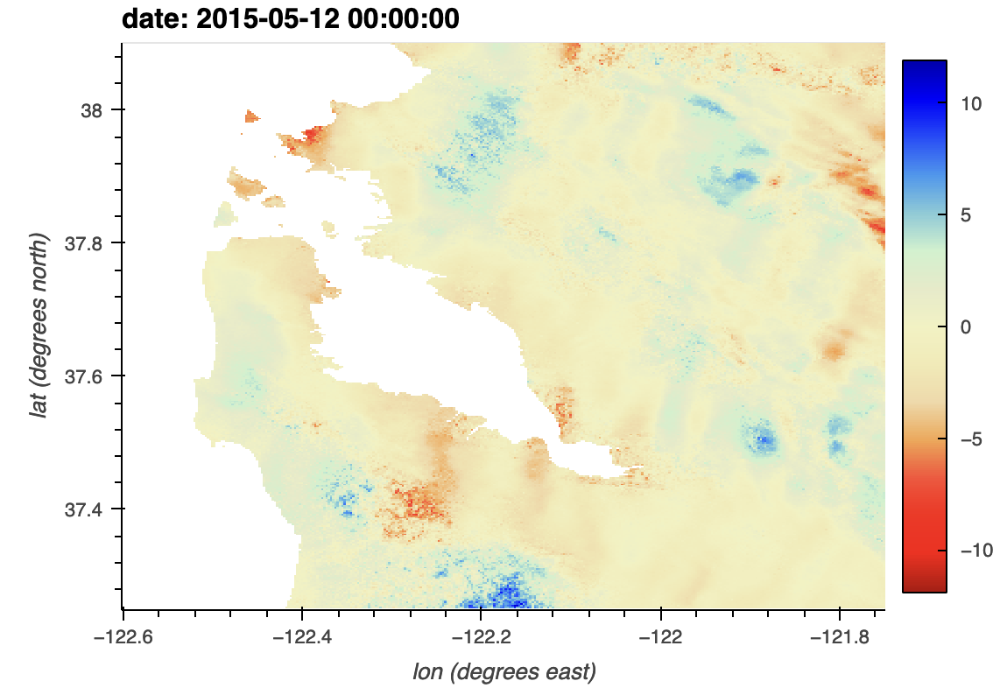

# trodi

Label outliers on a stack of interferograms, either at the pixel level, or SAR-scene level.

## Installation

Recommended to have a conda environment set up.

```bash
pip install trodi
```
Note that you need to install GDAL if you are not using simple binary files with a ROI_PAC ".rsc" file describing the dimensions:
```
conda install gdal
# Or if you are using mamba for quicker installation (https://github.com/mamba-org/mamba), mamba install gdal
```


To make an editable installation
```
git clone https://github.com/scottstanie/trodi
cd trodi
pip install -e .
```
If you're using a conda environment
```
conda install --file requirements.txt
# mamba install --file requirements.txt
pip install -e .
```

## Usage

If you have a set of unwrapped interferograms (".unw" files) in a folder called "igrams",  

```
$ trodi --search-path igrams 
[03/04 22:37:15] [INFO core.py] Searching for igrams in igrams/ with extention .unw
[03/04 22:37:15] [INFO core.py] Found 9 igrams, 5 unique SAR dates
[03/04 22:37:15] [INFO utils.py] Making dimensions and variables
[03/04 22:37:15] [INFO utils.py] Writing dummy data for igrams
[03/04 22:37:15] [INFO core.py] Averaging 4 igrams for 2015-02-08 (1 out of 5)
[03/04 22:37:15] [INFO core.py] Averaging 4 igrams for 2015-03-28 (2 out of 5)
[03/04 22:37:15] [INFO core.py] Averaging 3 igrams for 2015-04-09 (3 out of 5)
[03/04 22:37:15] [INFO core.py] Averaging 3 igrams for 2015-05-27 (4 out of 5)
[03/04 22:37:15] [INFO core.py] Averaging 4 igrams for 2015-06-20 (5 out of 5)
[03/04 22:37:16] [INFO logger.py] Total elapsed time for create_averages : 0.02 minutes (1.26 seconds)
[03/04 22:37:17] [INFO core.py] Computing 5 sigma outlier labels at scene level.
[03/04 22:37:17] [INFO core.py] Saving outlier labels to labels_scene.nc:/labels
[03/04 22:37:17] [INFO core.py] Saving data to labels_scene.nc:/data
[03/04 22:37:17] [INFO core.py] Saving threshold to labels_scene.nc:/threshold
```

To get pixel-level labels:
```
$ trodi --level pixel --outfile labels_pixel.nc 
```

With the labels recorded, we can read these in Python with xarray, (or h5py, or a NetCDF reader):

```python
import xarray as xr
>>> ds = xr.open_dataset("labels.nc")
>>> ds
<xarray.Dataset>
Dimensions:    (date: 5)
Coordinates:
  * date       (date) datetime64[ns] 2015-02-08 2015-03-28 ... 2015-06-20
Data variables:
    labels     (date) bool ...
    data       (date) float32 ...
    threshold  float32 ...

>>> print(ds['labels'])
<xarray.DataArray 'labels' (date: 5)>
array([False, False, False, False,  True])
Coordinates:
  * date     (date) datetime64[ns] 2015-02-08 2015-03-28 ... 2015-06-20
```

The `labels` dataset gives a `True` for any SAR dates determined to be significantly noisier than the other acquisitions.

In MATLAB, you can read the results using `ncread`:

```matlab
>> ncread('labels_scene.nc', 'labels')
ans =
  5×1 int8 column vector
   0
   0
   0
   0
   1

>> ncread('labels_scene.nc', 'threshold')
ans =
    0.8059
```
We see that for this dummy example, the threshold was 0.8059 on the average interferograms.

You can check the `average_ifgs.nc` file on the labeled dates to see what the estimated atmosphere is.

# Example on real dataset

You can also test this out on an [example dataset](https://mintpy.readthedocs.io/en/latest/demo_dataset/) provided by MintPy and ARIA.

Area: San Francisco Bay, California, USA
Data: Sentinel-1 A/B descending track 42 during May 2015 - March 2020 (114 acquisitoins; Zenodo)
Size: ~2.7 GB

```bash
wget https://zenodo.org/record/4265413/files/SanFranSenDT42.tar.xz
tar -xvJf SanFranSenDT42.tar.xz
cd SanFranSenDT42
```

The unwrapped interferograms are in the `unwrappedPhase` folder.
They are provided as binary files with VRT files to load using GDAL (so you need to have GDAL installed, e.g. `mamba install gdal`) where the first band is the phase.

Note that there is a watermask provided, but it uses "0"s to indicate where the water is. We'll add the `--mask-is-zero` option to flip that to numpy masking conventions.

```
$ trodi --search-path unwrappedPhase/ --ext .vrt --band 1  --max-temporal 250 --mask-files mask/watermask.msk --mask-is-zero
[07/07 10:30:27] [INFO core.py] Searching for igrams in unwrappedPhase/ with extention .vrt
[07/07 10:30:27] [INFO core.py] Found 505 igrams, 114 unique SAR dates
[07/07 10:30:27] [INFO utils.py] Making dimensions and variables
[07/07 10:30:27] [INFO utils.py] Writing dummy data for average_ifgs
[07/07 10:30:27] [INFO core.py] Averaging 3 igrams for 2015-05-12 (1 out of 114)
...
```

You can check the `average_ifgs.nc` file for each day's noise estimate:


See `trodi --help` for full option list.